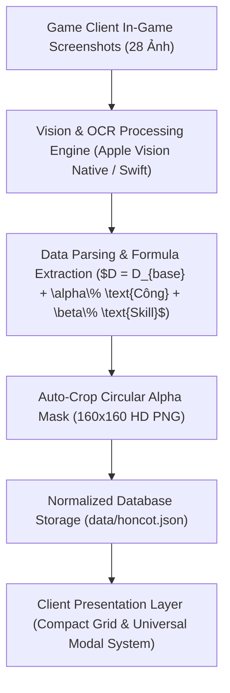

# 📑 BÁO CÁO KỸ THUẬT & TIẾN TRÌNH PHÁT TRIỂN HỆ THỐNG WIKI
**Hệ Thống:** Douluo MMO Wiki & Studio Platform  
**Phiên Bản Kiến Trúc:** V3.2-Engineering  
**Tác Giả & Kỹ Thuật:** Dev by shaikowannasleep  
**Mục Tiêu:** Chuẩn hóa dữ liệu Hồn Cốt & Hồn Hạch, tối ưu hóa giao diện người dùng (UI/UX) và tích hợp SEO chuyên sâu.

---

## 🔬 1. TỔNG QUAN KIẾN TRÚC & PIPELINE XỬ LÝ DỮ LIỆU (SYSTEM ARCHITECTURE)



### 1.1. Chuỗi Pipeline Phân Tích Hình Ảnh (Game Vision & OCR Pipeline):
- **Trích Xuất Văn Bản Gốc:** Sử dụng native Apple Vision Framework qua module Swift CLI (`tools/ocr_cli`), đạt tốc độ nhận diện ~0.05s/ảnh với độ chính xác tuyệt đối trên cả chữ Hán Giản Thể và Phồn Thể.
- **Thuật Toán Tách Icon Hình Tròn (Circular Alpha Masking):**
  $$\text{Tọa độ tâm: } (x_c, y_c) = (0.298 \cdot W, 0.475 \cdot H), \quad R \approx 0.09 \cdot \min(W, H)$$
  Áp dụng bộ lọc khử răng cưa đa tầng (Anti-Aliased 4x Supersampling) để xuất ra file icon `.png` tròn nền trong suốt chuẩn Retina.
- **Chuẩn Hóa Kỹ Năng & Mốc Niên Đại (Milestone Pairing):** Ghép nối cặp 2 ảnh cuộn tạo thành 1 thực thể Hồn Cốt hoàn chỉnh, chứa đầy đủ từ mốc cơ sở 2000 năm đến 5 mốc đột phá (1 Vạn $\rightarrow$ 10 Vạn Năm kèm số sao ⭐).

---

## 📊 2. MA TRẬN DỮ LIỆU 15 HỒN CỐT ĐÃ TRIỂN KHAI (DATA MATRIX)

| STT | Tên Hán Việt | Tên Hiển Thị Chuẩn | Vị Trí (Slot) | Loại Kỹ Năng / Cơ Chế | Mốc Niên Đại (Tiers) |
| :---: | :--- | :--- | :---: | :--- | :---: |
| **01** | Thánh Tựu Hư Thiên Đầu Cốt | Xương Đầu Thánh Tựu Hư Thiên | `head` | Sát Thương & Cường Hóa Đánh Thường | 1v $\rightarrow$ 10v (5 Cấp ⭐) |
| **02** | Thiên Quân Nghĩ Vương Hữu Tí Cốt | Xương Tay Phải Thiên Quân Nghĩ Vương | `right_arm` | Tăng ST Duy Trì / Nhân Đôi ST khi Máu < 30% | 1v $\rightarrow$ 10v (5 Cấp ⭐) |
| **03** | Thiên Diễn Băng Quy Hữu Thối Cốt | Xương Chân Phải Thiên Diễn Băng Quy | `right_leg` | Tăng ST Duy Trì / Hiệu Ứng Linh Hỏa Chớp Sáng | 1v $\rightarrow$ 10v (5 Cấp ⭐) |
| **04** | U Uyên Lãnh Chúa Tả Tí Cốt | Xương Tay Trái U Uyên Lãnh Chúa | `left_arm` | Sát Thương Sấm Sét / Cộng Dồn Lang Thú | 1v $\rightarrow$ 10v (5 Cấp ⭐) |
| **05** | Tam Nhãn Ma Vượn Tả Thối Cốt | Xương Chân Trái Tam Nhãn Ma Vượn | `left_leg` | Tia Laze Tiêu Diệt / Khắc Chế Thánh Diễm | 1v $\rightarrow$ 10v (5 Cấp ⭐) |
| **06** | Cuồng Triệt Lôi Hùng Hữu Tí Cốt | Xương Tay Phải Cuồng Triệt Lôi Hùng | `right_arm` | Tịch Diệt Lôi Đình / Khuếch Đại Quá Tải 10 Sét | 1v $\rightarrow$ 10v (5 Cấp ⭐) |
| **07** | Cuồng Triệt Lôi Hùng Hữu Thối Cốt | Xương Chân Phải Cuồng Triệt Lôi Hùng | `right_leg` | Tập Vân Bôn Lôi / Tích 20 Tầng Uẩn Lôi | 1v $\rightarrow$ 10v (5 Cấp ⭐) |
| **08** | Đãng Hồn Linh Long Hữu Tí Cốt | Xương Tay Phải Đãng Hồn Linh Long | `right_arm` | Bộc Phát / Tia Phục Thỉ & Giảm CD Thiêu Đốt | 1v $\rightarrow$ 10v (5 Cấp ⭐) |
| **09** | Đãng Hồn Linh Long Hữu Thối Cốt | Xương Chân Phải Đãng Hồn Linh Long | `right_leg` | Nhiễm Hồn Xâm Thực / Độc Tố Chớp Sáng | 1v $\rightarrow$ 10v (5 Cấp ⭐) |
| **10** | Đạp Tinh Lang Vương Tả Tí Cốt | Xương Tay Trái Đạp Tinh Lang Vương | `left_arm` | Chấn Động Tinh Thể / Chuyển Hóa Yên Diệt | 1v $\rightarrow$ 10v (5 Cấp ⭐) |
| **11** | Đạp Tinh Lang Vương Tả Thối Cốt | Xương Chân Trái Đạp Tinh Lang Vương | `left_leg` | Khiên Tinh Thể / Hồi Máu Khi Khiên Vỡ | 1v $\rightarrow$ 10v (5 Cấp ⭐) |
| **12** | Lưu Độc Long Tích Tả Tí Cốt | Xương Tay Trái Lưu Độc Long Tích | `left_arm` | Vụ Nổ Độc Tố / Cộng Hưởng Trúng Độc | 1v $\rightarrow$ 10v (5 Cấp ⭐) |
| **13** | Lưu Độc Long Tích Tả Thối Cốt | Xương Chân Trái Lưu Độc Long Tích | `left_leg` | Khống Chế Choáng (Stun 1.0s) / Độc Kịch Độc | 1v $\rightarrow$ 10v (5 Cấp ⭐) |
| **14** | Băng Bích Đế Hoàng Hạp Hữu Tí Cốt | Xương Tay Phải Băng Bích Đế Hoàng Hạp | `right_arm` | Băng Hoàng Yên Diệt / Nổ Kép 2 Lần | 1v $\rightarrow$ 10v (5 Cấp ⭐) |
| **15** | Băng Bích Đế Hoàng Hạp Hữu Thối Cốt | Xương Chân Phải Băng Bích Đế Hoàng Hạp | `right_leg` | Lịch Chiến Sương Hàn / Tăng ST Đánh Thường | 1v $\rightarrow$ 10v (5 Cấp ⭐) |

---

## ⚡ 3. TỐI ƯU HÓA GIAO DIỆN & TRẢI NGHIỆM NGƯỜI DÙNG (UI/UX DESIGN)

### 3.1. Compact Equal-Height Grid System:
- **Cân Bằng Chiều Cao Tuyệt Đối:** Sử dụng CSS Grid Stretch kết hợp Flexbox `flex: 1` cho container kỹ năng, đảm bảo tất cả các thẻ trong cùng một hàng đều có chiều cao cân xứng hoàn hảo theo thẻ dài nhất.
- **Trực Quan Hóa Mô Tả Kỹ Năng:** Toàn bộ công thức tính toán sát thương được hiển thị đầy đủ ngay trên mặt thẻ ngoài mà không bị cắt lửng bởi `line-clamp`.
- **Tối Giản Hóa Mặt Thẻ:** Loại bỏ các thông số chi tiết của từng mốc niên đại ở mặt ngoài để giảm tải thị giác (Cognitive Load Reduction), chuyển sang huy hiệu chỉ báo `✦ 5 Mốc Niên Đại (1v ➔ 10v)` và nút CTA `🔍 Xem Mốc Niên Đại ➔`.

### 3.2. Universal Modal System (Cơ Chế Đóng Đa Kênh):
- Tích hợp lớp phủ làm mờ nền chiều sâu (`backdrop-filter: blur(10px)`).
- **Hỗ Trợ 3 Kênh Tương Tác Đóng:**
  1. *Backdrop Click-Outside:* Bấm chuột vào bất kỳ vị trí nào bên ngoài khung nội dung modal.
  2. *Keyboard Event Listener:* Bấm phím `Escape (ESC)` trên bàn phím.
  3. *Close Button:* Bấm icon đóng `[✕]` góc trên bên phải.
- Áp dụng đồng bộ cho toàn bộ hệ thống Modal trong Project (Hồn Cốt, Hồn Hạch, Hero Detail, Team Builder).

---

## 🌐 4. CHIẾN LƯỢC TỐI ƯU HÓA CÔNG CỤ TÌM KIẾM (ADVANCED SEO SUITE)

### 4.1. Meta Tags & Keywords Targeted Strategy:
- **Từ Khóa Mục Tiêu Cao Cấp (High-Intent Gaming Keywords):**  
  `đấu la vng`, `đấu la đại lục hồn sư đối quyết wiki`, `bách khoa đấu la mmo`, `tra cứu hồn cốt đấu la`, `hồn cốt 10 vạn năm`, `bộ hồn hạch 24 sao`, `đội hình đấu la mạnh nhất`, `soul bone douluo wiki`, `soul core build`.
- **OpenGraph & Twitter Card Protocol:** Tích hợp đầy đủ metadata chuẩn Social Sharing, giúp hiển thị card xem trước đẹp mắt khi chia sẻ liên kết lên Facebook, Telegram, Discord, Twitter/X.

### 4.2. Dữ Liệu Cấu Trúc Google Schema.org (JSON-LD):
- Triển khai schema `@type: WebSite`, `@type: ItemPage`, và `@type: BreadcrumbList` giúp Google Bot thu thập dữ liệu nhanh chóng và gia tăng cơ hội xuất hiện trên **Google Rich Snippets & Search Features**.

---

## 🔮 5. LỘ TRÌNH PHÁT TRIỂN TIẾP THEO (ENGINEERING ROADMAP)

```
[Phase 1: Completed] ➔ Chuẩn hóa 15 Hồn Cốt + Compact Equal-Height Grid + Universal Modal System
[Phase 2: Upcoming]  ➔ Xây dựng Module Bóc Tách Hồn Hạch (Set 2 & Set 4, Mốc 4★ - 24★)
[Phase 3: Planned]   ➔ Nâng cấp Soul Bone Builder Engine (Tự động cộng dồn chỉ số 6 món)
[Phase 4: Planned]   ➔ Module Compare Tool (So sánh đối đầu 2 trang bị cùng vị trí)
[Phase 5: Planned]   ➔ Canvas High-Resolution Export Card (Xuất ảnh chia sẻ cộng đồng)
```

---
*Tài liệu kỹ thuật được lưu trữ nội bộ và tự động đồng bộ cùng hệ thống phiên bản Git.*
